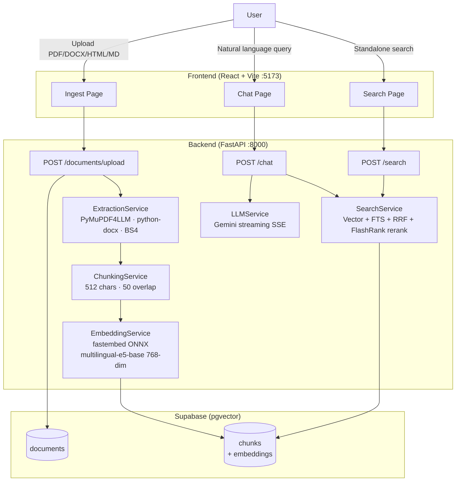

# RAG Document Search Engine

A self-hosted Retrieval-Augmented Generation (RAG) system for document ingestion, multilingual semantic search, and LLM-powered question answering. Upload PDFs, Word documents, HTML, or Markdown files and query them in natural language.
 
---
## Quick Start

### Prerequisites

- [Docker](https://docs.docker.com/get-docker/) and Docker Compose
- A [Supabase](https://supabase.com) project (or local [Supabase CLI](https://supabase.com/docs/guides/cli))
- A [Google Gemini API key](https://aistudio.google.com/app/apikey) (for LLM answers)

---

### Option A — Docker Compose (recommended)

**1. Configure environment**

```bash
cp .env.example .env
```

Open `.env` and fill in the required values:

```
SUPABASE_URL=https://your-project.supabase.co
SUPABASE_ANON_KEY=your-anon-key
SUPABASE_SERVICE_KEY=your-service-role-key
SUPABASE_JWT_SECRET=your-jwt-secret
GEMINI_API_KEY=your-gemini-api-key

# Frontend (Vite)
VITE_SUPABASE_URL=https://your-project.supabase.co
VITE_SUPABASE_ANON_KEY=your-anon-key
VITE_API_URL=http://localhost:8000
```

**2. Start all services**

```bash
docker compose up --build
```

This starts three services:

| Service | URL |
|---------|-----|
| Frontend (React) | http://localhost:5173 |
| Backend (FastAPI) | http://localhost:8000 |
| Supabase DB (Postgres) | localhost:54322 |

**3. Open the app**

Navigate to [http://localhost:5173](http://localhost:5173), sign up, and start uploading documents.

---

### Option B — Local development (no Docker)

**Backend**

```bash
cd backend
python3 -m venv venv
source venv/bin/activate          # Windows: venv\Scripts\activate
pip install -r requirements.txt

# Copy and fill in .env at the project root, then:
uvicorn app.main:app --reload
# API available at http://localhost:8000
```

**Frontend**

```bash
cd frontend
npm install
npm run dev
# App available at http://localhost:5173
```

---

## Tech Stack

| Layer | Technology |
|-------|-----------|
| **Backend API** | FastAPI, Uvicorn |
| **PDF extraction** | PyMuPDF4LLM (Markdown-oriented, no torch) |
| **DOCX extraction** | python-docx |
| **HTML extraction** | BeautifulSoup4 + lxml |
| **Embeddings** | fastembed (ONNX, CPU-only) — `intfloat/multilingual-e5-base` (768-dim) |
| **Reranking** | FlashRank (ONNX) — `jinaai/jina-reranker-v2-base-multilingual` |
| **LLM / Chat** | Google Gemini (`gemini-2.5-flash`) via `google-genai` |
| **Korean FTS** | python-mecab-ko (morphological tokenization) |
| **Database** | Supabase — PostgreSQL 15 + pgvector + Row-Level Security |
| **Frontend** | React 19, TypeScript, Vite, TailwindCSS v4, shadcn/ui, React Router v7 |
| **Auth** | Supabase Auth (JWT) |

> No PyTorch required anywhere. All ML inference is ONNX-based and runs on CPU.

---

## Architecture



---

## Project Structure

```
RAG/
├── .env                        # Environment variables (not committed)
├── .env.example                # Template for .env
├── docker-compose.yml          # Multi-service orchestration
│
├── backend/
│   ├── Dockerfile
│   ├── requirements.txt
│   └── app/
│       ├── main.py             # FastAPI app, lifespan, routers
│       ├── core/
│       │   └── config.py       # Pydantic settings from .env
│       ├── api/
│       │   ├── auth.py         # JWT auth dependency
│       │   ├── documents.py    # Document CRUD + upload
│       │   ├── search.py       # Hybrid search + SQL tool
│       │   └── chat.py         # RAG chat (SSE streaming)
│       └── services/
│           ├── extraction.py   # PyMuPDF4LLM · python-docx · BS4
│           ├── chunking.py     # Character-based text splitter
│           ├── embedding.py    # fastembed ONNX embeddings
│           ├── search.py       # Hybrid search + rerank pipeline
│           ├── sql_tool.py     # Rule-based text-to-SQL
│           └── llm.py          # Gemini streaming LLM
│
├── frontend/
│   ├── Dockerfile
│   ├── package.json
│   └── src/
│       ├── App.tsx             # Routes: /ingest, /chat, /search, /login, /signup
│       ├── pages/
│       │   ├── Ingest.tsx      # Drag-drop upload, document table
│       │   ├── Chat.tsx        # RAG chat with streaming answer + source cards
│       │   ├── Search.tsx      # Standalone search results
│       │   ├── Login.tsx
│       │   └── Signup.tsx
│       ├── components/
│       │   ├── layout/         # AppLayout, ProtectedRoute
│       │   └── ui/             # shadcn/ui components
│       ├── hooks/
│       │   └── useAuth.tsx     # Supabase auth context
│       └── lib/
│           ├── supabase.ts     # Supabase client
│           └── api.ts          # Axios wrapper with JWT
│
├── supabase/
│   └── migrations/             # SQL: tables, pgvector, RLS policies
│
└── docs/
    └── ARCHITECTURE.md         # Pipeline details (search, SQL tool, chat)
```

---

## Environment Variables

Copy `.env.example` to `.env` and fill in the values below.

### Required

| Variable | Description |
|----------|-------------|
| `SUPABASE_URL` | Supabase project URL (e.g. `https://xxx.supabase.co`) |
| `SUPABASE_ANON_KEY` | Supabase anon/public key |
| `SUPABASE_SERVICE_KEY` | Supabase service role key (bypasses RLS for ingestion) |
| `SUPABASE_JWT_SECRET` | JWT secret for token verification |
| `GEMINI_API_KEY` | Google Gemini API key (for LLM answers in `/chat`) |
| `VITE_SUPABASE_URL` | Same as `SUPABASE_URL` — exposed to the frontend |
| `VITE_SUPABASE_ANON_KEY` | Same as `SUPABASE_ANON_KEY` — exposed to the frontend |
| `VITE_API_URL` | Backend URL as seen from the browser (e.g. `http://localhost:8000`) |

### Optional (with defaults)

| Variable | Default | Description |
|----------|---------|-------------|
| `EMBEDDING_MODEL` | `intfloat/multilingual-e5-base` | fastembed model name |
| `EMBEDDING_DIM` | `768` | Embedding vector dimension |
| `CHUNK_SIZE` | `512` | Characters per chunk |
| `CHUNK_OVERLAP` | `50` | Overlap between adjacent chunks |
| `RERANK_MODEL` | `jinaai/jina-reranker-v2-base-multilingual` | FlashRank reranker model |
| `TOP_K` | `5` | Number of chunks to return per search |
| `VECTOR_SIMILARITY_THRESHOLD` | `0.6` | Minimum cosine similarity for vector results |
| `SEARCH_SCORE_THRESHOLD` | `0.5` | Minimum rerank score (0–1) to include a result |
| `MAX_CHUNKS_PER_DOCUMENT` | `3` | Maximum chunks returned per document |
| `SEARCH_NO_OVERLAP_PENALTY` | `0.5` | Score multiplier when chunk has no query-term overlap |
| `SEARCH_DEBUG` | `false` | Log pipeline stats at INFO level |
| `GEMINI_MODEL` | `gemini-2.5-flash` | Gemini model name |
| `MAX_UPLOAD_SIZE_MB` | `50` | Maximum upload file size |
| `CORS_ORIGINS` | `["http://localhost:5173"]` | Allowed frontend origins |

---

## API Reference

All endpoints (except `/health`) require a `Authorization: Bearer <jwt>` header.
Base URL: `http://localhost:8000/api/v1`

### Documents

| Method | Path | Description |
|--------|------|-------------|
| `POST` | `/documents/upload` | Upload a file — runs the full ingestion pipeline |
| `GET` | `/documents` | List all documents for the current user |
| `GET` | `/documents/{id}` | Get document details and chunk count |
| `DELETE` | `/documents/{id}` | Delete document, its chunks, and the stored file |
| `GET` | `/documents/{id}/chunks` | Paginated list of chunks (`?page=1&per_page=20`) |

**Supported upload formats:** PDF, DOCX, HTML, Markdown, plain text (max 50 MB)

### Search

| Method | Path | Description |
|--------|------|-------------|
| `POST` | `/search` | Hybrid semantic + keyword search, reranked |
| `POST` | `/search/sql` | Natural language → SQL over document metadata |

**`POST /search` request body:**
```json
{
  "query": "string",
  "top_k": 5,
  "document_ids": []
}
```

### Chat

| Method | Path | Description |
|--------|------|-------------|
| `POST` | `/chat` | RAG chat — retrieves context, streams Gemini answer via SSE |

**`POST /chat` request body:**
```json
{
  "query": "string",
  "top_k": 5
}
```

**SSE stream events (in order):**

| Event | Payload | Description |
|-------|---------|-------------|
| `sources` | `[{chunk_id, document_name, score, content, ...}]` | Retrieved source chunks |
| `token` | `{"content": "..."}` | Streamed answer token |
| `done` | `{}` | Stream end |

### Health

| Method | Path | Description |
|--------|------|-------------|
| `GET` | `/health` | Returns `{"status": "ok"}` — no auth required |

---

## Pipelines

### Ingestion Pipeline

```
Upload file
    │
    ├─ Validate MIME type + file size
    ├─ Deduplicate via SHA-256 content hash
    ├─ Store file in Supabase Storage
    ├─ Create document record (status: "processing")
    │
    ├─ Extract text
    │     PDF  → PyMuPDF4LLM.to_markdown()
    │     DOCX → python-docx
    │     HTML → BeautifulSoup4
    │     MD/TXT → read as-is
    │
    ├─ Chunk text (512 chars, 50-char overlap, recursive splitter)
    ├─ Embed chunks (fastembed, multilingual-e5-base, 768-dim)
    └─ Insert chunks + vectors into Supabase (pgvector)
```

### Search & RAG Pipeline

```
User query
    │
    ├─ Embed query (fastembed, same model as ingestion)
    ├─ Vector search  → cosine similarity on pgvector
    ├─ Keyword search → PostgreSQL full-text search (MeCab for Korean)
    ├─ RRF fusion     → merge vector + keyword rankings
    ├─ FlashRank rerank → multilingual cross-encoder scoring
    └─ Return top-K chunks (filtered by SEARCH_SCORE_THRESHOLD)
         │
         └─ (Chat only) Build prompt → stream Gemini answer via SSE
```

---

## Deployment (AWS MVP)

Hybrid layout: **React + FastAPI on AWS**, **Supabase Cloud** for database/auth/storage.

| Guide | Description |
|-------|-------------|
| [docs/SUPABASE_SETUP.md](docs/SUPABASE_SETUP.md) | Project setup, migrations, storage bucket, verify script |
| [docs/SUPABASE_PRODUCTION.md](docs/SUPABASE_PRODUCTION.md) | Auth Site URL, redirect URLs, production checklist |
| [docs/DEPLOYMENT_AWS.md](docs/DEPLOYMENT_AWS.md) | ECS Fargate, App Runner, Amplify, S3 + CloudFront |

**Quick checks**

```bash
./scripts/verify-supabase.sh          # Supabase reachable
docker compose -f docker-compose.prod.yml up   # local prod-like stack (frontend :8080)
```

**Production Docker**

- Backend: `backend/Dockerfile.prod`
- Frontend: `frontend/Dockerfile.prod` (nginx + static `dist/`)
- Template env: [`.env.production.example`](.env.production.example)
- AWS scripts: [`deploy/aws/`](deploy/aws/)

---

## Development Notes

- **No PyTorch.** Embeddings (`fastembed`) and reranking (`flashrank`) are fully ONNX-based and run on CPU. The stack is lightweight and deployable without a GPU.
- **Korean support.** `python-mecab-ko` handles morphological tokenization for Korean full-text search. The embedding and reranker models are multilingual (Korean + English).
- **Row-Level Security.** All Supabase tables enforce RLS: users can only access their own documents and chunks.
- **PDF quality.** PyMuPDF4LLM outputs Markdown from PDFs, preserving headers, tables, and lists — better context for the LLM than plain text extraction.
- **Supabase migrations.** SQL schema files live in `supabase/migrations/`. Apply `001_init.sql` and `002_storage_documents_bucket.sql` in the Supabase SQL Editor (or via local `supabase-db` in dev compose).

### Roadmap

| Phase | Status |
|-------|--------|
| Phase 1 — Ingestion, hybrid search, rerank, chat UI | Complete |
| Phase 2 — Gemini LLM streaming chat | Complete |
| Phase 3 — Conversation history, polish, scale | Planned |
